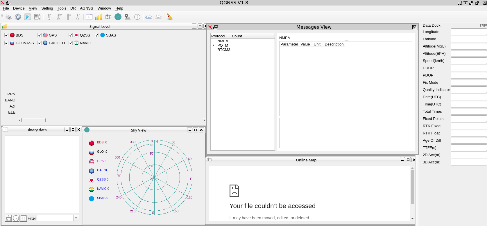

# Attempt to compile QGNSS for GNU/Linux

Although a Qt5 application, the QGNSS source code includes many Microsoft 
specific C++ compiler features not availabe in GCC (``g++``) and hardly 
available in LLVM (``clang++``). Although the executable is generated, it is
not functional at the moment since most functions in
``QGNSS_FW_UPG/QGNSS_FW_UPG/uart/QG_Uart_win.cpp`` have been commented out,
meaning serial communication is *not* functional. Other functions that were
removed to reach compilation but should be inserted back are
```bash
$ grep -r JMF * | grep cpp
QGNSS/deviation_map.cpp:    ui->customPlot->axisRect(0)->setAutoMargins(QCP::msNone); // 去除边框 JMF
QGNSS/device_info.cpp://    MSG* msg = reinterpret_cast<MSG*>(message);  // JMF
QGNSS/device_info.cpp://    if (msg->message == WM_DEVICECHANGE)         // JMF
QGNSS_FW_UPG/QGNSS_FW_UPG/uart/QG_Uart_win.cpp:#include "QG_Uart.h"   // JMF this whole file has been broken and must be adapted to unix tty
```

See the [patch](patch) file generated with ``git diff`` after modifying the original source code so
it compiles under GNU/Linux.

## Requirements:

Dependencies (Debian GNU/Linux unstable): at least
```
sudo apt install qtwebengine5-dev qttools5-dev
```
and a functional ``clang/clang++`` compiler (``sudo apt install clang`` after of course at least ``build-essential``).

## Compiling:

```
qmake QGNSS.pro  # generate Makefile in current directory
make             # generate Makefile in QGNSS: check that CC = clang and CXX = clang++
./DevRuntimeEnv/QGNSS  # execute application
```



Version compiled and executed on Debian GNU/Linux.

At the moment ``QGNSSLog`` is failing to compile due to the dependency with ``QNMEA/3rdpart`` which might be
provided as binary library only
